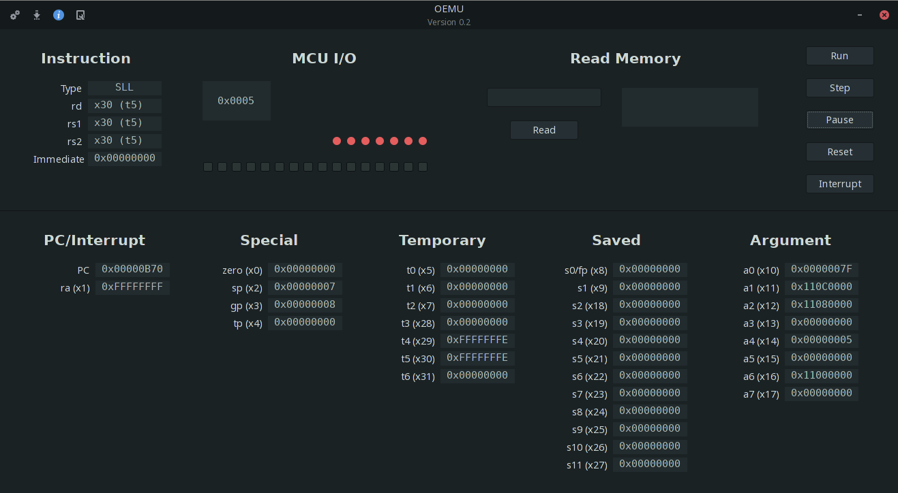

# otter-emu

WIP emulator for Cal Poly's RISC-V RV32I chip written in Rust.
Run binaries compiled for the RV32I architecture.

## Preview

## Build requirements

### Linux (targeting Linux)

- Rust
- GTK

### Windows

See the `gtk-rs`
[documentation](https://gtk-rs.org/docs-src/tutorial/cross).
